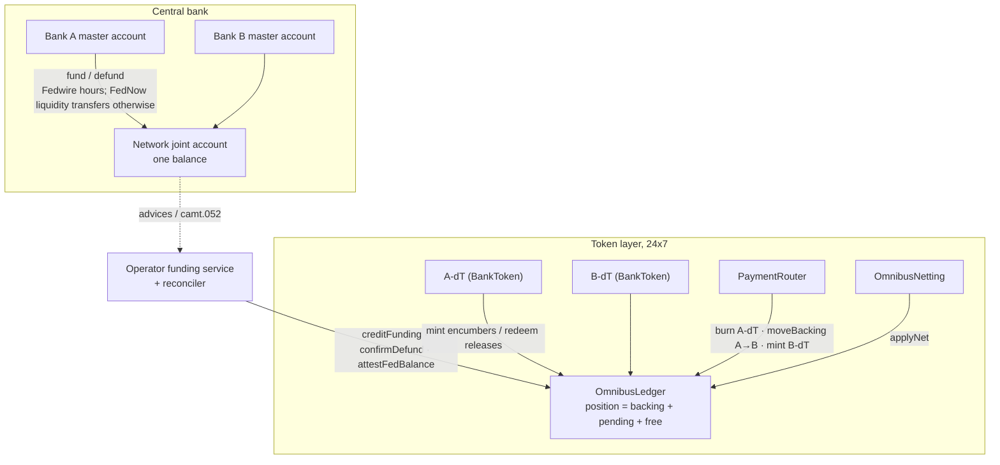
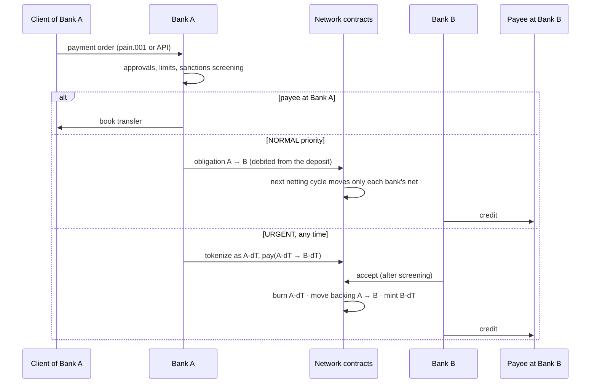

# omnibus-deposit-network

A reference model of an interbank network in which **each member bank issues
its own tokenized deposits**, backed one-for-one by that bank's share of a
single joint (omnibus) reserve account at the central bank. A network
operator keeps the positions ledger; payments between customers of different
banks convert one bank's token into another's at par, in one transaction,
without moving money at the central bank.

It contains the Solidity contracts, a Go back office and simulator of the
Fedwire/FedNow side, a member bank's payment hub (`services/payments-svc`)
with its portals, and the tests that pin the model's invariants.

> All banks, customers, tickers, BICs and routing numbers are fictional.
> Bank A, B and C issue A-dT, B-dT and C-dT; member ids are SWIFT
> test-style codes (`BNKAUS30`); routing numbers are sequential patterns that
> pass the ABA check digit and are not meant to match any real bank.

## Documentation

| Read | For |
|---|---|
| [docs/business-flows.md](docs/business-flows.md) | What happens for clients, banks and the operator: funding, urgent and netted payments, liquidity shortfalls, exceptions, defunds, DvP, tokens on other chains |
| [docs/contract-flows.md](docs/contract-flows.md) | The contract calls behind each flow, the check on each call, and its effect on the positions ledger |
| [docs/across-networks.md](docs/across-networks.md) | Other chains (hub and spoke, two-key mint, caps, connecting a chain), other rails (Fedwire, FedNow, RTP, non-members), other banks and networks |
| [docs/dvp-where-the-asset-lives.md](docs/dvp-where-the-asset-lives.md) | Settling a tokenized security against a deposit token on the security's chain |
| [docs/contract-operations.md](docs/contract-operations.md) | Roles, emergency controls, deployment, replacing a token, assurance |
| [docs/contract-map/index.html](docs/contract-map/index.html) | An interactive map of the contracts with step-through flows (open it in a browser) |

## The model



**The invariant.** A member's position splits into `backing + pendingDefund
+ free`. Backing always equals its token's total supply (at home and on
other chains) and can never be defunded; it leaves a bank's position only
together with the tokens it backs, when a holder pays a customer of another
member. `Σ positions` equals the joint account's statement balance, which a
reconciler key (not the funding key) attests.

**How value moves.**

| Movement | What happens | Central-bank balance |
|---|---|---|
| Fund | Bank sends pacs.009 master → joint; the operator posts `creditFunding` on the advice, once per UETR | changes |
| Mint | Bank debits a customer's deposit and mints its token, encumbering free position | — |
| On-us payment | ERC-20 transfer of the same token | — |
| Cross-bank payment | `PaymentRouter.pay`: burn A-dT, move backing A→B, mint B-dT; at once, or held until the receiving bank accepts, rejects with an ISO reason code, or the window expires | — |
| Return | `returnPayment` by the payee; `requestReturn` (camt.056) by the payer | — |
| Redeem | Holder burns; the bank credits the deposit | — |
| Netting | Deposit-funded obligations in `OmnibusNetting`, settled gross or in verified multilateral cycles | — |
| Other chains | Burn here, attested message, mint there; backing stays, recorded as remote supply | — |
| Defund | Bank requests free position back; maker-checker; pacs.009 joint → master in Fedwire hours | changes |
| Interest | Allocated by time-weighted position | changes |

**Two clocks.** Tokens move 24x7; reserves move only in the central bank's
operating day. A Saturday payment between customers of two banks settles at
once, because it moves ownership inside the joint account rather than money
into or out of it. Fedwire (or a FedNow liquidity transfer) is needed only at
the edges, to move reserves between a bank's own master account and the joint
account.

## Flows at a glance

A client payment, from order to credit:



| Flow | Business outcome | Contracts |
|---|---|---|
| Fund / defund | A bank moves reserves into or out of its position; defunds are maker-checker and only from free position | `OmnibusLedger` |
| Mint / redeem | A deposit becomes the bank's token and back | `BankToken` → `OmnibusLedger` |
| Instant payment | Settled at once, 24x7, final, receiver can screen first | `PaymentRouter` |
| Netted payment | Queued obligations settle by net, saving liquidity | `OmnibusNetting` |
| Tokens abroad | A bank's deposit held on another chain, still backed at home | `CrossChainMessenger`, `RemoteBankToken` |
| DvP | A security and the cash settle together on the security's chain | `DvPSettlement` |
| Controls | Suspend, pause, freeze, recover, replace a token | all, see [contract-operations.md](docs/contract-operations.md) |

Step-by-step versions: [business-flows.md](docs/business-flows.md) and
[contract-flows.md](docs/contract-flows.md).

## Beyond the home chain

**Cross-chain, burn and mint.** `crosschain/CrossChainMessenger` moves a
member's tokens to and from other chains the way CCTP moves USDC, with the
backing staying in the joint account. Every mint needs **two keys**, the
network's attester threshold and the issuing bank's own signature, so no one
else can create a bank's deposits anywhere. Home caps each corridor and every
other chain caps each member's supply; other chains talk only to home;
undeliverable transfers bounce back; a bank's revocations follow its token.

**DvP where the asset lives.** `dvp/DvPSettlement` settles a tokenized
security against a bank's deposit token on the security's own chain, gross
and atomic, with the cash delivered from home together with its trade
instruction. See [docs/dvp-where-the-asset-lives.md](docs/dvp-where-the-asset-lives.md).

**Across networks.** The reserves, the ledger and cross-bank conversion
stay home; other chains connect as spokes of the home chain, each with its own
caps and each bank's own holder registry, and a new chain is connected
through the timelock without touching the others. Fedwire and FedNow are used
only to fund and defund; payees outside the network are paid from the bank's
own systems. Light-client corridors, non-EVM chains and links between two
networks are design only. See [docs/across-networks.md](docs/across-networks.md).

**Operating the contracts.** Restrictive actions are fast (a guardian
suspends, pauses, lowers caps, drops an attester), permissive ones go through
a timelock (admission, new attesters, higher caps); every admin hands over in
two delayed steps; a flawed token can be replaced without moving its backing;
the deployment scripts end with the deployer holding no role. See
[docs/contract-operations.md](docs/contract-operations.md).

## The payment hub

`services/payments-svc` is a member bank's payment hub: go-kratos with
proto-first gRPC and HTTP APIs, Wire, Ent on PostgreSQL, and moov-io for the
financial standards (ISO 20022 pain.001 in, pain.002 and camt.053 out; OFAC
screening against the SDN list; ABA check digits; banking days). Payment
orders go through maker-checker, limits, payee checks and sanctions holds,
and are routed to book transfer, netting or the token network; each order's
UETR is its on-chain reference, so a retried order finds its payment instead
of paying twice. `services/payments-portal` is its web front end. See
[services/payments-svc/README.md](services/payments-svc/README.md).

## Layout

| Path | What it is |
|---|---|
| `contracts/src/omnibus/OmnibusLedger.sol` | Positions ledger over the joint account: members, backing/pending/free, funding and defunds, interest, attested reconciliation, token replacement |
| `contracts/src/omnibus/BankToken.sol` | One bank's token: mint, redeem, holds for pending payments, ERC-7943 controls, issuer pause, migration from a predecessor |
| `contracts/src/omnibus/PaymentRouter.sol` | Cross-bank payments and swaps: burn, move backing, mint; accept/reject/expire; returns |
| `contracts/src/omnibus/OmnibusNetting.sol` | Interbank obligations: gross now, or verified multilateral netting cycles |
| `contracts/src/omnibus/HolderRegistry.sol` | A bank's allowlist of wallets for its token |
| `contracts/src/omnibus/crosschain/` | Burn-and-mint messenger and the remote-chain token |
| `contracts/src/omnibus/dvp/` | DvP of a tokenized security against a deposit token |
| `contracts/script/` | Deployment scripts and `VerifyRoles` |
| `contracts/test/omnibus/` | 143 Foundry tests: scenarios, fuzzed invariants (Σ positions = central-bank balance, backing = supply here and abroad, venue escrow), deployment |
| `internal/{iso20022,fedwire,operator,bank,chain,omnibus,demo}` | Go back office: ISO 20022 messages, the central-bank simulator, the operator's funding, reconciliation and netting services, a bank's core ledger and gateway |
| `internal/clearing/` | Multilateral netting planner and gridlock resolution |
| `internal/{workflow,api,web,webhook,stack}`, `cmd/omnibus-web` | The first net/http prototype of the payment hub, kept for its end-to-end test |
| `cmd/omnibus-demo/` | A business week end to end on a local anvil node |
| `docs/` | Business and contract flows, cross-network design, DvP, operations, the interactive contract map |
| `services/payments-svc/`, `services/payments-portal/` | The payment hub and its portals |

## Run it

```bash
# Contracts
cd contracts && forge soldeer install && forge build && forge test

# Go, including the end-to-end tests on anvil (they skip without ANVIL_BIN or anvil on PATH)
go test ./...

# One business week on a local anvil node
go run ./cmd/omnibus-demo

# The payment hub and its black-box end-to-end test
(cd services/payments-svc && make build-demo && ./bin/payments-svc -conf configs)
(cd services/payments-svc && make e2e)

# Static analysis and coverage
make slither
make coverage
```

## Open questions the code cannot answer

- **Tokenized deposits, not stablecoins.** Each token is its bank's deposit
  liability. The one-for-one backing is an issuance limit and an operational
  earmark, not a legally segregated reserve; whether holders have any claim
  on it in a member's insolvency is for counsel and the rulebook.
- Whether the central bank would open a joint account for this purpose, on
  what terms, and whether it would pay interest on it.
- Which record is authoritative, and how system-rule finality applies to
  position moves made by a contract.
- On public chains: when settlement is final, and who may hold a bank's
  deposit token there.
