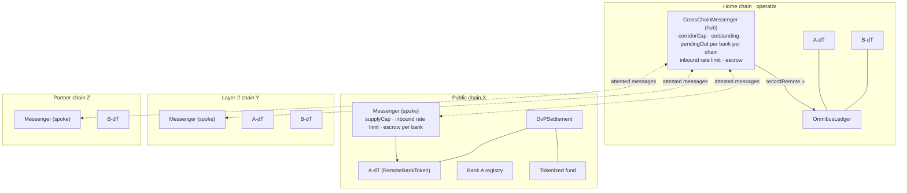

# Across networks

The model has one home: a joint account at the central bank and one chain
where the operator keeps the positions ledger. This page covers how it reaches
beyond that home in three directions:

- **Other chains.** A bank's token can be held and used on public and partner
  chains.
- **Other payment rails.** Fedwire, FedNow, RTP and payees outside the
  network.
- **Other banks, operators and currencies.**

For each it separates what the code does today from what is design only. The
call-level detail is in [contract-flows.md](contract-flows.md).

## What never leaves home

Whatever network a token travels to, four things stay on the home chain and
at the central bank:

| Stays home | Why |
|---|---|
| The reserves, in the joint account | A token abroad is the same bank liability; its backing is counted as supply abroad (`remoteSupply`), never moved |
| The positions ledger | One ledger, one reconciliation against one Fed statement |
| Cross-bank conversion (A-dT → B-dT) | `moveBacking` needs the ledger. Abroad, a bank's token moves only between that bank's admitted holders |
| Funding, defunding, interest | They follow the Fed, which only sees the joint account |

## 1. Other chains

### Shape: hub and spoke

Other chains talk only to home, never to each other. Moving A-dT from
chain X to chain Y is two hops through home. In exchange, home always knows
exactly how much of each bank's supply sits on each chain (`outstanding`).

### Lock, mint, then burn

No token is burned before its mint on the other chain is proven:

1. `depositForBurn` locks the sender's tokens in the source messenger's
   escrow and records the move PENDING with a deadline.
2. The destination mints, with both keys and inside its caps and rate limit,
   before the deadline, records the nonce MINTED and sends an attested
   MINT_ACK back.
3. On the MINT_ACK the source burns the escrow.

If the destination cannot mint, anyone records the nonce CANCELLED there once
the deadline has passed (or at once if the recipient cannot hold the token);
it can then never mint. An attested MINT_CANCEL goes back and the source
returns the escrow to the sender, or to the bank's suspense wallet if the
sender can no longer hold the token. A nonce is minted or cancelled, never
both. Home counts a move abroad only once it is minted (on the MINT_ACK);
until then the amount is home supply in escrow. Nothing is ever counted
twice, and a halted destination strands nothing: the escrow waits, unburned,
until the move completes or is cancelled.

### Trust: two keys, and a budget and a rate per chain

A chain is only as safe as what can mint on it. The messenger limits both:

- **Who can mint.** Every mint, on every chain, needs a strict majority of
  the operator's attesters **and** the issuing bank's own key. The operator
  alone cannot create a bank's deposits anywhere, and neither can the bank
  alone.
- **How much.** Home caps each bank's corridor to each chain (`corridorCap`,
  closed until governance opens it). Each chain caps each bank's supply there
  (`supplyCap`). A chain can never send home more than home sent to it. If a
  chain, its attesters or both keys were lost, the loss stops at those caps.
- **How fast.** Every receiving chain, home included, rate-limits what
  arrives, per source chain and bank: a token bucket of `capacity` that
  refills linearly over `window`. Governance sets both through the timelock;
  the guardian may only shrink or slow a bucket, at once. An unset bucket is
  closed. Each mint, and each escrow released by a cancellation, draws on it;
  a message over the bucket reverts and is retried after it refills, or is
  cancelled after its deadline, so nothing is lost. The limit sits on the
  receiving side because that is where a forged message does its damage. In
  a 2026 incident a single verifier, reading the source chain from poisoned
  nodes, approved a forged inbound message, and with no limit on the
  receiving side about $292M was released at once. A limit on the sending
  chain cannot stop that: the forged message was never sent there.
- **Who can hold.** A bank admits holders on each chain in its own registry
  there. Revocations made at home follow the token to every chain
  (`sendRevocation`); admissions never do, so a compromised hub can restrict
  but never admit.

Sizing a corridor cap is a business decision: it is what a bank is prepared
to lose if that chain fails. A bucket is sized the same way, per window: what
the bank accepts losing before people can react, if every key on a message
were compromised.

**Legal form.** A token on another chain must be the same deposit, issued
natively there by the same bank, not a token that represents a claim on a
deposit locked somewhere else. The escrow in the messenger is not such a
lock: it lasts only until the mint is proven and then burns, or returns to
its sender if the move is cancelled, and no holder abroad can ever redeem
against it. Wrapping would be a classification risk: a US regulator's 2026
tokenized-deposit proposal asks whether a token representing a claim on a
locked deposit might be a stablecoin rather than a deposit.

### Connecting a new chain

What the code supports today, for an EVM chain:

1. **Operator:** deploy the spoke messenger and a DvP venue with
   `script/DeployRemote.s.sol`. It needs the timelock, guardian, attesters,
   threshold, the home and local domain ids, and the home messenger.
2. **Each bank that wants to be there:** deploy its registry and
   `RemoteBankToken` with `script/DeployBank.s.sol --sig "runRemote()"`. The
   script grants the messenger the registrar role on the bank's registry, so
   revocations from home can apply.
3. **Governance, through the timelock, on both sides:**
   - `setRemote(domain, messenger)` on home and on the new chain;
   - `setToken(member, token)` for each bank;
   - `setIssuerAttester(member, bankKey)` with the bank's key for that chain;
   - `setSuspense(member, wallet)` for returns that nobody can hold;
   - `setSupplyCap(member, cap)` on the new chain;
   - `setRateLimit(sourceDomain, member, capacity, window)` on both sides:
     on the new chain for messages from home, at home for messages from the
     new chain (cancellations draw on it too);
   - `setMoveTimeout(seconds)` on each side, if the default day does not fit
     the chain's finality;
   - `setCorridorCap(member, domain, cap)` at home. This is the step that
     opens the corridor.
4. **Close the deployment:** `script/VerifyRoles.s.sol` must pass (governance
   holds every admin; the deployer holds nothing).
5. **Operate:** set the attesters' finality rule for that chain. Each bank
   admits its holders there.

Nothing changes for chains already connected, and no existing contract is
redeployed.

### Finality is per chain

Attesters sign a message only once the event behind it is final on the chain
where it happened: the lock for a TRANSFER, the mint for a MINT_ACK, the
cancellation for a MINT_CANCEL. The destination cannot check this itself, so
the rulebook sets the rule for each chain:

| Source chain type | A reasonable finality rule |
|---|---|
| The home chain (BFT consensus) | Final on commit |
| Ethereum mainnet | The finalized checkpoint (about 13 minutes) |
| A rollup | Its batch finalized on the underlying chain; or, by rulebook decision, the sequencer's confirmation within a smaller cap |
| A permissioned partner chain | Its own consensus finality, as its operator documents it |

There is deliberately no "fast transfer" in which attesters sign before
finality.

### How messages travel

| Transport | Status | What it changes |
|---|---|---|
| **Operator attesters** (m of n) + issuer key | **Built** (`CrossChainMessenger`, envelope version 4) | — |
| **Light-client verification** (for example IBC between chains that support it) | Design | Proof that the lock (or, on the way back, the mint) happened, checked against the source chain's consensus, replaces trust in the attester majority for that corridor. Adopt per corridor, once that light client has been audited. The bank's key still co-signs every mint. |
| **Third-party message networks** | Design, by exception | Only as carriers of already co-signed messages. They never receive mint rights over a bank's token. |

The rule behind the table is that mint power stays with the operator and the
issuing bank. A transport can only carry a message or prove one; it cannot
authorize one. A third-party network is acceptable only as a carrier: for
example, a network that lets the issuer require its own verifier on every
message, so nothing is delivered without the issuer's check. A network whose
own attestation authorizes the mint is excluded, whatever its security
record, because it would hold mint power over a bank's deposits.

**Every verifier reads the chain itself.** Each attester and each issuing
bank reads the source chain from nodes it runs itself. None relies on a
shared, hosted or third-party endpoint, so poisoning one provider's nodes
cannot make two independent verifiers see the same false event.

### Bounds on a failed chain or transport

What each failure can cost, with the code as built:

| Failure | What stops it | Worst case |
|---|---|---|
| The destination chain halts, or its messenger is paused | Nothing was burned; the escrow waits at the source | Funds wait until the chain resumes and the move completes, or until it is cancelled there after the deadline (`cancel` works while the messenger is paused, but not while the chain itself is down) |
| Attesters or the issuer stop signing a move | The deadline | After it, anyone cancels; the escrow returns to the sender |
| A recipient cannot hold the token | `cancel` at once | The escrow returns, or lands in the bank's suspense wallet |
| A forged TRANSFER with every key valid (verifiers fed false data, or keys stolen) | Rate limit on the receiving chain, then `supplyCap` abroad or `outstanding` at home | One bucket per window per bank, never more than the cap |
| A forged MINT_CANCEL for a move that was minted | It must match a pending move, and its release draws on the receiving bucket | The pending escrow of moves to that chain, within the bucket |
| A forged MINT_ACK | It must match a pending move | The sender's escrow burns without a mint; nothing is created, and home's count abroad over-states that amount (backing stays locked) until reconciled |
| A transport that drops or delays messages | Messages are idempotent by nonce and stay deliverable | Delay; deadlines turn a lost TRANSFER into a cancellation |
| A transport that alters a message | Signatures over the exact bytes | Nothing: the altered message is refused |

### Non-EVM chains

The contracts are Solidity. A non-EVM chain needs a port of the spoke
messenger, the remote token and the registry that keeps the same checks: two
keys, supply cap, used nonces, holder policy, freeze, forced transfer,
recovery and pause. The home side does not change. None is built.

### What a public chain reveals

On a public chain, balances and transfers of a bank's token are visible to
anyone. The design keeps client payments on the home chain and takes tokens
abroad only for what must happen there, such as settling against an asset
issued on that chain.

## 2. Other payment rails

### Fedwire and FedNow: only at the edges

The joint account is an account at the Fed, so only the Fed's own transfer
services move reserves in or out of it. Payments inside the network never use
them.

| Event | Rail |
|---|---|
| A bank funds its position | pacs.009 master → joint over Fedwire, or a FedNow liquidity management transfer when Fedwire is closed |
| A bank defunds | pacs.009 joint → master, in Fedwire hours |
| Interest on the joint account | The Fed's credit to the joint account |
| Reconciliation | The Fed's statement and intraday reports for the joint account (camt.053, camt.052) |
| Every payment between members | None: ownership moves inside the joint account |

### RTP and other instant rails

The joint-account structure is the one prefunded instant-payment systems
already use: banks prefund an account at the Fed, and the system's ledger
moves ownership inside it. This network differs in what the ledger can do:

- tokens that banks and their clients hold and program against (holds,
  freezes, DvP);
- no per-payment cap;
- netting as well as gross settlement;
- the same dollars usable on other chains.

The message flow maps one to one onto ISO 20022, so a bank's payment hub
treats the network as one more rail:

| Network | ISO 20022 |
|---|---|
| `pay` | pacs.008 |
| `accept` / `reject(code)` | pacs.002 ACSC / RJCT with the reason code |
| `returnPayment` | a new credit referencing the original |
| `requestReturn` | camt.056, answered with camt.029 |

### Payees outside the network

The network pays members only. The hub refuses an order to a non-member's
routing number (RC01). A bank pays everyone else from its own systems over
RTP, FedNow, Fedwire or ACH as it does today. `services/payments-svc` routes
between book transfer, instant on-network and netting. Adding an off-network
route there is the natural next step, but it is not built.

## 3. Other banks, operators and currencies

### Adding a member bank

Existing members see no change:

1. The bank deploys its registry and token (`DeployBank.run`), with its own
   issuer, compliance, pauser and registrar keys.
2. The operator's timelock admits it: `admitMember` with its token, its
   gateway key, a different approver key, and whether it screens inbound
   payments. Then `setLimits` (issuance cap, prefund
   requirement), `registerWallet` for its settlement wallet, and, per chain,
   `setToken` and `setIssuerAttester`.
3. `VerifyRoles` passes.
4. The bank funds its position (pacs.009) and starts tokenizing.

### A second network or currency

Each network is its own home: its own central-bank account, operator, ledger
and chain. Two networks' tokens are different liabilities over different
reserves. The contracts are currency-neutral apart from naming and the cent
rule for defunds (`CENT`, 6 decimals), so a network in another currency
deploys the same set with its own operator.

Connecting two networks is design, not code:

- **Same chain, two spokes.** Network 1 can connect network 2's home chain
  as one of its spokes, and the reverse. Both networks' tokens can then sit
  on the same chain, each capped and co-signed by its own issuer.
- **PvP there.** A payment-versus-payment contract on that chain could swap
  a network-1 token for a network-2 token atomically, the way
  `DvPSettlement` swaps a security for cash. Across currencies the swap
  carries an FX rate agreed off-chain.
- **What it would not do.** It would not merge ledgers or move reserves
  between central banks. Each network keeps reconciling to its own account.

## Summary

| | Built | Design only |
|---|---|---|
| Other chains | EVM spokes, two-key mint, caps, inbound rate limits, lock-then-burn with cancellation, revocation, DvP, deploy and verify scripts | Light-client corridors, non-EVM ports, third-party carriers |
| Other rails | Fedwire/FedNow funding and defunding (simulated), ISO 20022 throughout, RC01 for non-members | Off-network payouts from the hub |
| Other banks | Member admission through the timelock, per-bank deploy | — |
| Other networks | — | Shared-chain spokes, PvP between networks' tokens |
