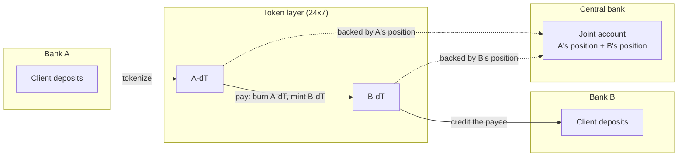
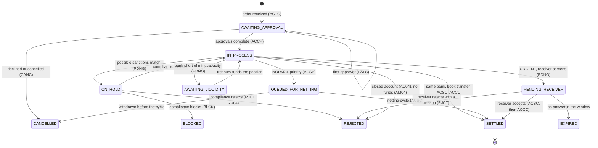
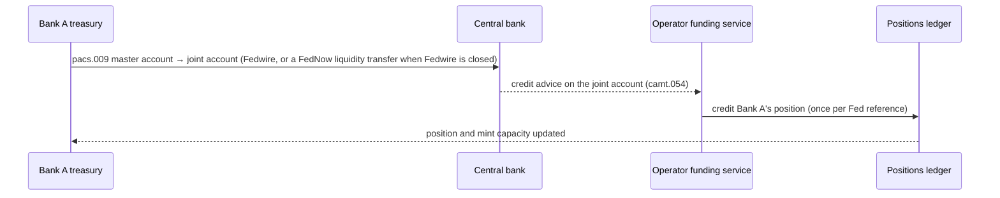
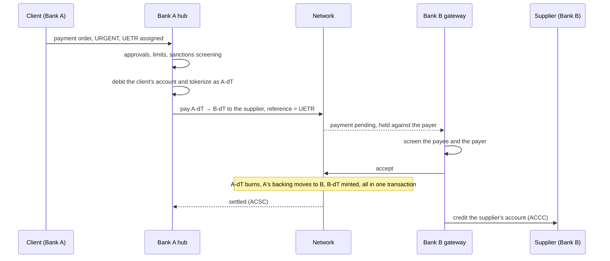
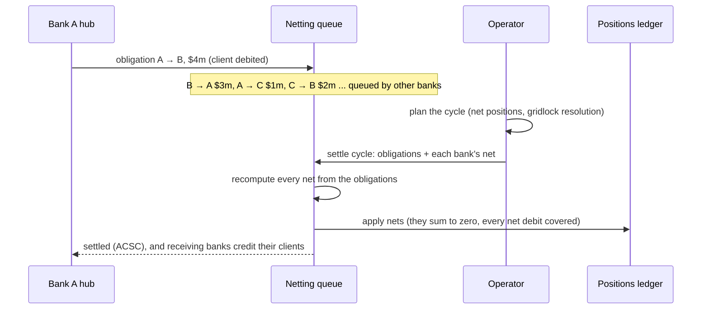
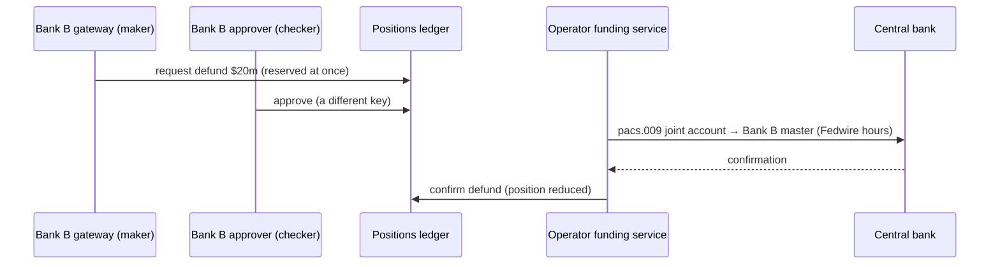

# Business flows

What happens, step by step, for the people involved: a corporate client
paying a supplier, a bank's treasury funding its position, compliance holding
a payment, the operator closing the day. The contract calls behind each step
are in [contract-flows.md](contract-flows.md); how the same model reaches
other chains and rails is in [across-networks.md](across-networks.md).

All banks, clients and identifiers are fictional.

## Who is involved

| Party | Role in the network | Systems in this repo |
|---|---|---|
| **Corporate client** | Holds a deposit account at its bank and sends payment orders. Never sees a token. | `services/payments-svc` client API, `services/payments-portal` |
| **Member bank** (Bank A, Bank B, Bank C) | Issues its own deposit token (A-dT, B-dT, C-dT) against its share of the joint account. Its treasury funds and defunds that share; its compliance team screens and can freeze; its gateway answers inbound payments. | `internal/bank` (core ledger and gateway), the hub's operations console |
| **Network operator** | Runs the network: keeps the positions ledger over the joint account, posts Fed credits, attests the Fed statement, runs netting cycles, attests cross-chain messages. Admits members through a timelock. | `internal/operator`, `internal/clearing`, the hub's network console |
| **Central bank** | Holds the joint account and each bank's own master account. Sees one balance for the network. | `internal/fedwire` (simulator) |

## Three layers of the same dollar

A dollar a client sends moves through three layers, and each party only sees
the layers it needs:

| Layer | What it is | Who sees it |
|---|---|---|
| Deposit | The client's account balance at its bank | Client, its bank |
| Token | The bank's deposit token, the on-chain form of the same liability | Banks and the operator; never the client |
| Reserves | The bank's position in the joint account at the central bank | Banks, the operator; the central bank sees only the total |

The rule tying them together: **every token outstanding is backed one for one
by its bank's position**, and the positions always add up to the joint
account's balance at the central bank.

## A payment order's life

Every order in the payment hub follows one lifecycle. The ISO 20022 status in
brackets is what the client receives in its pain.002 report and webhooks.

Before an order executes, the hub has already checked:

- **Duplicates.** Each create carries an `Idempotency-Key`. The end-to-end id
  and the pain.001 message id are unique per client.
- **Maker-checker and limits.** Each client has a per-payment and a daily
  limit, and a number of approvers other than the maker who must sign off.
- **The payee.** The receiving bank must be a network member. An order to a
  non-member is refused when it is submitted (in a pain.001 file, that row is
  rejected with RC01 and the rest proceed).
  `POST /v1/payees/verify` asks the receiving bank whether the account exists
  and is open.
- **Sanctions.** Every creditor is screened against the OFAC SDN list. A
  possible match holds the order for the bank's compliance team; it is not a
  rejection.

The order's **priority** chooses the route:

| Route | When | Settles | Liquidity it uses |
|---|---|---|---|
| Book transfer | Payee at the same bank | At once, in the bank's core ledger | None |
| Instant, on-network | `URGENT`, to another member | At once, 24x7, as tokenized deposits | The payment's own amount, from the bank's position |
| Netting cycle | `NORMAL`, to another member | At the operator's next cycle | Only each bank's net |

## Flow 1: A bank funds its position

Every bank keeps a position in the joint account so it can tokenize client
payments. Treasury tops it up in the morning, or at any time the position
runs low.

- The Fed reference can be posted once only; a replayed advice is refused.
- A bank's **mint capacity** is its free position above its prefund
  requirement, within its issuance cap. The hub checks it before tokenizing.

## Flow 2: An urgent payment to another bank, any time

A client of Bank A pays a supplier who banks at Bank B, on a Saturday
afternoon, for $25m.

- **Nothing moves at the central bank.** Bank A's reserves become Bank B's
  inside the joint account. That is why the payment settles on a Saturday and
  above the $10m per-payment limit of today's instant rails.
- **The receiving bank decides.** A bank that asks to screen inbound payments
  has a window (30 seconds by default, at most an hour) to accept or reject
  with an ISO reason code. If it does neither, anyone can expire the payment
  and the payer's tokens are released. A bank that does not ask to screen
  receives at once.
- **A retry never pays twice.** The on-chain payment id derives from the payer
  and the UETR. The hub looks it up before sending again.
- **If the payment fails,** the hub redeems the tokens back into the client's
  account and reports the reason (RJCT with the receiver's code).

## Flow 3: A normal payment through netting

Most payments do not need to settle this second. A `NORMAL` order is debited
from the client's account and queued as an **obligation** between the two
banks. The operator settles all queued obligations in a netting cycle that
moves only each bank's net.

- **Liquidity saving.** Offsetting obligations cancel. Only the net moves,
  which is how large-value netting systems settle trillions on a small
  fraction of that in prefunding.
- **The chain does not trust the planner.** The contract recomputes each net
  from the obligations and refuses a mismatch. A bank whose net debit exceeds
  its free position stops the cycle; the planner defers its obligations.
- **Gross when it matters.** A paying bank can pull one obligation out of the
  queue and settle it gross at once. Obligations expire after a time-to-live.

## Flow 4: A payment short of liquidity

On a weekend, Bank A's mint capacity is below an urgent order.

1. The order goes to `AWAITING_LIQUIDITY`; the client sees "waiting for Bank A
   to make liquidity available".
2. Bank A's treasury receives an alert with the shortfall.
3. Treasury funds the position with a FedNow liquidity management transfer,
   because Fedwire is closed (Flow 1).
4. The hub sees the new capacity and sends the payment. No new order and no
   new approvals are needed.

## Flow 5: Exceptions

| Situation | What happens | Client sees |
|---|---|---|
| Possible sanctions match | Order held; the bank's compliance team releases, blocks or rejects | `ON_HOLD`, then `SETTLED`, `BLOCKED` (funds blocked; the OFAC report is due within 10 business days) or `REJECTED` RR04 |
| Payee's bank is not a member | Refused at submission, before anything moves | an error; RC01 for a row in a pain.001 file |
| Closed account at the same bank | Refused | `REJECTED` AC04 |
| Not enough funds | Refused | `REJECTED` AM04 |
| Receiving bank rejects | Hold released, tokens redeemed into the client's account | `REJECTED` with the receiver's code |
| Receiving bank does not answer | Payment expires; tokens redeemed back | `EXPIRED` |
| Payee sends money back | A return, linked to the original, in the tokens each side used; never more than the original | a credit, referencing the original |
| Payer asks for money back after settlement | A request for return (camt.056); the payee decides | request logged |
| A holder's key is lost | The issuing bank moves the balance to a new key and blocks the old one | nothing |
| A court or regulator orders a freeze | The issuing bank freezes part or all of a holder's balance | account restricted |

## Flow 6: A bank takes reserves back

At the end of the day a bank may bring surplus reserves home. Only free
position can leave: reserves backing tokens in circulation can never be
withdrawn.

- A defund must leave the bank's prefund requirement in place and is refused
  during a reconciliation break.
- If the Fed rejects the wire, the operator marks the defund failed and the
  amount returns to free position.

## Flow 7: Interest and reconciliation

- **Interest.** When the central bank pays interest on the joint account, the
  operator allocates it to banks by time-weighted position: a position held
  for a second earns a second's share, so topping up just before allocation
  buys nothing. Interest goes to banks, not to token holders.
- **Reconciliation.** A reconciler, a different key and team from funding,
  attests the Fed's closing balance (camt.053). If it differs from the ledger,
  **minting and defunding stop** until the books agree; payments between
  holders continue.

## Flow 8: Settling a security trade where it lives

A Bank A client buys shares of a tokenized fund issued on a public chain.
The cash goes to the fund's chain; the fund does not come to the network.

1. Buyer and seller affirm the same trade terms; the trade is matched.
2. The buyer's bank sends A-dT to that chain with the trade id attached. The
   tokens burn at home; the backing stays in the joint account.
3. The cash arrives at the settlement contract. In the same transaction the
   shares move from seller to buyer and the cash to the seller, or neither
   moves.
4. Cash that arrives late, twice or for the wrong amount is credited to its
   owner, never lost, and can be sent back home.

Details: [dvp-where-the-asset-lives.md](dvp-where-the-asset-lives.md).

## Flow 9: Holding a bank's deposits on another chain

A client wants to hold A-dT on another chain (to trade there, or to pay a
counterparty that lives there).

1. The client sends A-dT to the other chain. It burns at home and is counted
   as Bank A's supply abroad; the backing stays in the joint account.
2. The operator's attesters **and Bank A's own key** sign the message. Nobody
   else can create Bank A's deposits anywhere.
3. A-dT mints on the other chain, but only to a holder Bank A admitted there.
   If the recipient is not admitted, the transfer comes back.
4. When Bank A drops a holder, its revocation follows the token to every
   chain.

The limits are set per bank and per chain. Home caps how much can leave for
each chain; each chain caps how much can exist there. Details:
[across-networks.md](across-networks.md).

## Who can stop what

| Who | Can stop at once | Undo needs |
|---|---|---|
| Operator's guardian | A member (no minting, defunding or receiving; its holders can still pay out); new payments; cross-chain sending; a corridor's or chain's limit; a suspect attester | The operator's timelock |
| An issuing bank | Its own token (transfers, mints, redemptions, forced transfers); a holder's balance (freeze) | The same bank |
| Reconciler | Minting and defunding, automatically, on any Fed mismatch | A matching statement, or the governor |

Payers are never trapped: an expired payment's hold can be released even while
the router is paused, and a paused settlement venue still lets owners withdraw
their credits.

## ISO 20022 map

| Business event | Message |
|---|---|
| Client payment order | pain.001 in; pain.002 status reports out |
| Payment on the network | pacs.008 (the payment), pacs.002 (accept ACSC / reject RJCT) |
| Funding and defunding | pacs.009 between master and joint accounts |
| Credit and debit advices | camt.054; intraday camt.052 |
| Statement | camt.053 (client account; the Fed joint account for reconciliation) |
| Request for return | camt.056, answered with camt.029 |
| Securities settlement | sese.023 / sese.024 / sese.025 |
