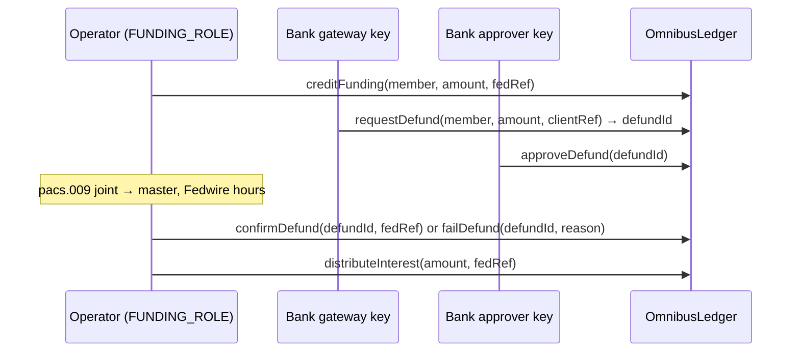
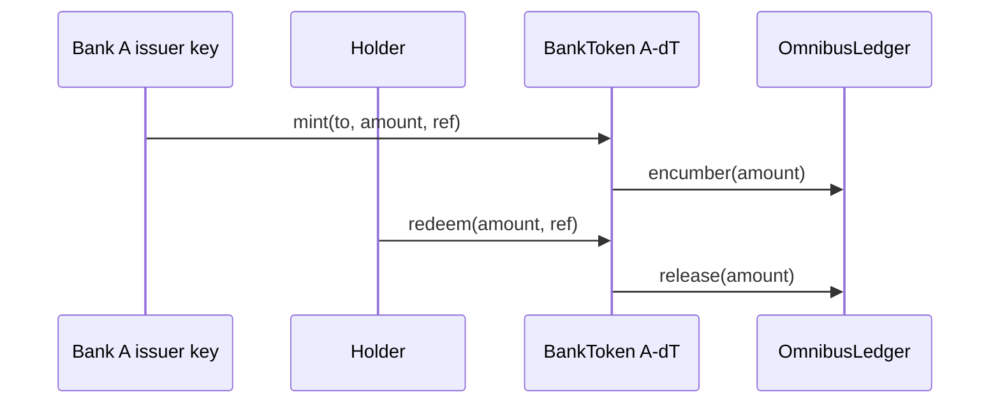
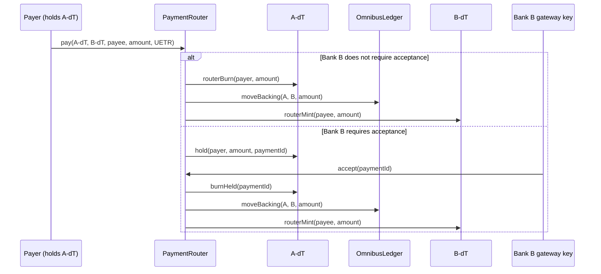
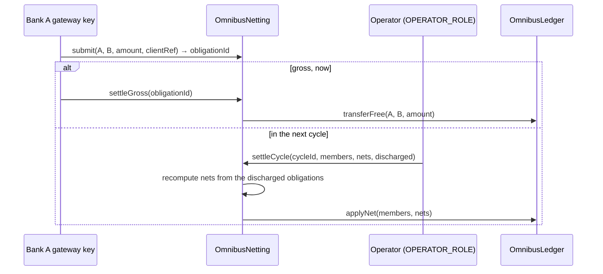
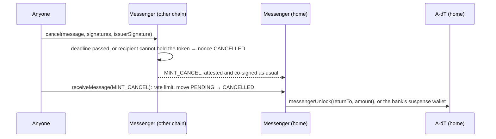
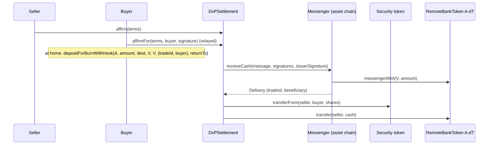

# Contract flows

The on-chain calls behind each business flow in
[business-flows.md](business-flows.md): who calls what, which check applies,
and what each call does to the positions ledger. Governance, deployment and
token replacement are in [contract-operations.md](contract-operations.md).
An interactive version of these flows, with the contracts on a map, is in
[contract-map/index.html](contract-map/index.html) (open it in a browser).

## The contracts

| Contract | Chain | Holds | Called by |
|---|---|---|---|
| `OmnibusLedger` | home | Each member's position, backing, pending defunds and supply abroad; the joint account's expected balance | Operator services, member keys, the network contracts below |
| `BankToken` (one per bank) | home | The bank's deposit token: balances, holds, freezes, blocked keys | The bank's issuer, compliance and pauser keys; the router; the messenger; holders |
| `PaymentRouter` | home | Cross-bank payments and their status | Payers, receiving banks' gateways, anyone (expiry) |
| `OmnibusNetting` | home | Interbank obligations and settled cycles | Paying banks' gateways, the operator |
| `HolderRegistry` (one per bank per chain) | every chain | Who may hold the bank's token there | The bank's registrar; the messenger, for revocations |
| `CrossChainMessenger` | every chain | Attesters, threshold, issuer keys, caps, used nonces | Holders, relayers, the bank's registrar, governance |
| `RemoteBankToken` (one per bank per chain) | other chains | The bank's token abroad, with the same controls | The messenger; the bank's keys; holders |
| `DvPSettlement` | the asset's chain | Matched trades, escrow, credits | Buyers, sellers, relayers |

## The ledger's accounts

Every member has one position in the joint account, split three ways:

```
position = backing + pendingDefund + free
backing  = token supply at home + supply on other chains (remoteSupply)
Σ position over all members = omnibusTotal = the joint account's balance at the Fed
```

The tables below show each flow's effect on these figures. `Fed` is the joint
account's real balance at the central bank.

## Funding, defunding, interest



| Call | Check | position | backing | pending | free | omnibusTotal | Fed |
|---|---|---|---|---|---|---|---|
| `creditFunding` | `fedRef` unused; member admitted | +x | | | +x | +x | +x (already) |
| `requestDefund` | caller is the member's operator; not suspended; no reconciliation break; whole cents; leaves `prefundRequirement` free | | | +x | −x | | |
| `approveDefund` | caller is the member's approver | | | | | | |
| `cancelDefund` | operator or approver; not yet approved | | | −x | +x | | |
| `confirmDefund` | approved; `fedRef` unused | −x | | −x | | −x | −x (already) |
| `failDefund` | approved | | | −x | +x | | |
| `distributeInterest` | `fedRef` unused | +share each | | | +share | +amount | +amount |

`attestFedBalance(fedBalance, statementRef)` by `RECONCILER_ROLE` compares
the Fed's figure with `omnibusTotal`. A difference sets `reconciliationBreak`,
which refuses `encumber` (minting), `requestDefund` and `approveDefund`; a
matching statement, or the governor's `clearBreak`, lifts it.

## Mint and redeem



| Call | Check | backing | free |
|---|---|---|---|
| `mint` → `encumber` | `ref` unused; member not suspended; no break; free ≥ amount + `prefundRequirement`; backing within `issuanceCap` | +x | −x |
| `redeem` / `redeemFrom` → `release` | `ref` unused; available (unheld, unfrozen) balance; `redeemFrom` needs the holder's allowance | −x | +x |

The ledger knows which member is calling from the token's address: only a
registered token can encumber or release, and only its own member's position.

## Cross-bank payment



| Call | Check | A position | A backing | B position | B backing | Fed |
|---|---|---|---|---|---|---|
| `pay` (instant) or `accept` | different tokens; payee admitted by Bank B; id = hash(chain, router, payer, UETR) unused; B not suspended; A's backing net of supply abroad covers it | −x | −x | +x | +x | unchanged |
| `pay` (held) | the above; payer's available balance | | | | | |
| `reject(id, reasonCode)` | caller is Bank B's operator | hold released | | | | |
| `expire(id)` | after the deadline; anyone; works while paused | hold released | | | | |
| `returnPayment(originalId, amount, reason, ref)` | caller is the original payee; total returned ≤ original | +x | +x | −x | −x | unchanged |
| `requestReturn(originalId, reason)` | caller is the original payer | event only | | | | |

Free positions never change in a payment: the reserves travel with the tokens.
Payments in the same token are plain ERC-20 transfers and never touch the
router or the ledger.

**Interbank presentation.** A bank that ends up holding another bank's tokens
in its registered settlement wallet can present them with
`settleHeld(token, amount)`: they burn, and the issuer's backing becomes the
presenter's free position (issuer position and backing −x, presenter
position and free +x).

## Netting



| Call | Check | Effect |
|---|---|---|
| `submit` | caller is the payer's operator | Queued; nothing moves; expires after `ttl` (1 hour to 7 days) |
| `settleGross` | payer's operator; payer's free covers it | A position and free −x, B +x |
| `settleCycle` | `OPERATOR_ROLE`; cycle id unused; members and obligations strictly increasing; each net equals the recomputed net | — |
| `applyNet` | nets sum to zero; each debit covered by free; receivers not suspended | Each position ± its net; backing untouched |
| `cancel` / `expire` | payer's operator / anyone after expiry | Obligation closed; never settles later |

`liquidityEfficiencyBps()` reports value discharged per unit moved.

## Cross-chain transfer

Hub and spoke: home talks to every other chain; other chains talk only to
home. Lock, mint, then burn: no token is burned before its mint on the
other chain is proven.

```mermaid
sequenceDiagram
    participant H as Holder
    participant HM as Messenger (home)
    participant TA as A-dT (home)
    participant L as OmnibusLedger
    participant AT as Attesters (threshold)
    participant IK as Bank A issuer key
    participant RM as Messenger (other chain)
    participant RT as RemoteBankToken A-dT
    H->>HM: depositForBurn(A, amount, destDomain, recipient)
    HM->>HM: outstanding + pendingOut + amount ≤ corridorCap; move PENDING, deadline
    HM->>TA: messengerLock(holder, amount) (escrow in the messenger)
    HM-->>AT: MessageSent(TRANSFER)
    AT-->>RM: m-of-n signatures, once the lock is final
    IK-->>RM: issuer signature over the same message
    Note over RM: anyone relays (or only destinationCaller, if set)
    RM->>RM: receiveMessage: signatures, source messenger, nonce, issuer key,<br/>before deadline, supplyCap, rate limit (HOME, A) → MINTED
    RM->>RT: messengerMint(recipient, amount)
    RM-->>AT: MessageSent(MINT_ACK)
    AT-->>HM: signatures and issuer signature, once the mint is final
    HM->>HM: receiveMessage(MINT_ACK): move PENDING → COMPLETED
    HM->>L: recordRemote(A, +amount)
    HM->>TA: messengerBurnLocked(amount)
```

The way back is the mirror image: `depositForBurn` on the other chain locks
the tokens there; `receiveMessage` at home checks `amount ≤
outstanding[A][source]` and the rate limit, calls `recordRemote(A, −amount)`,
mints at home and sends a MINT_ACK; on it the other chain burns its escrow.

| Step | Home supply | escrow (home) | remoteSupply | backing | outstanding / pendingOut (home) | supply abroad |
|---|---|---|---|---|---|---|
| Lock at home | unchanged | +x | | unchanged | pendingOut +x | |
| Mint abroad | | | | | | +x (≤ `supplyCap`, bucket) |
| MINT_ACK at home | −x (escrow burns) | −x | +x | unchanged | outstanding +x, pendingOut −x | |
| Lock abroad | | | | | | unchanged (escrow abroad +x) |
| Mint at home | +x | | −x | unchanged | outstanding −x | |
| MINT_ACK abroad | | | | | | −x (escrow burns) |

Backing never moves, and home counts a move abroad only once it is minted
there: escrow at home stays in home supply until the MINT_ACK, and an inbound
move counts off when home mints it. Nothing is counted twice.

**Envelope.** `abi.encode(Envelope)`: version 4, kind (TRANSFER = 0,
POLICY = 2, MINT_ACK = 3, MINT_CANCEL = 4; version 3's RETURN = 1 is gone),
source and destination domains, nonce, source messenger, member, sender,
recipient, amount, `destinationCaller`, `returnTo`, `deadline` (TRANSFER: the
destination mints only before it), `refNonce` (MINT_ACK / MINT_CANCEL: the
TRANSFER they answer), `hookData`.

**Checks on every message** (`_open`): at least `threshold` distinct attester
signatures, sorted by signer; the right version and destination; the source
domain's registered messenger; an unused nonce; the member's issuer key
signed the same bytes. A reply must also match a PENDING move from that
destination, member and amount (`UnknownMove` otherwise).

**Rate limit.** Each receiving chain keeps a token bucket per (source domain,
member): `capacity`, refilled linearly over `window`. Every TRANSFER mint and
every MINT_CANCEL release draws on it. Over the bucket, `receiveMessage`
reverts with `RateLimited` and the message stays deliverable: the relayer
retries once the bucket refills, or the move is cancelled after its deadline.
An unset bucket is closed.

### Cancel and return



A cancelled nonce can never mint, and a minted one can never be cancelled.
Before the deadline only an undeliverable recipient allows a cancel; a paused
token or a full bucket makes a message wait. `cancel` works while the
messenger is paused. The escrow is the messenger's balance, but the messenger
is never an admitted holder: ordinary transfers to it, forced transfers or
recovery from it, and freezing it all revert.

### Revocation

`sendRevocation(member, account, destDomain, reason)` at home, by the bank's
registrar, emits a POLICY message. On arrival, the remote messenger (a
registrar of that chain's registry) calls `revoke(account, reason)`.
Admissions are never broadcast, so a hub key can restrict but never admit.

## Delivery versus payment



`receiveCash` never reverts for a business reason: cash for an unknown,
closed, already-funded, mismatched or late trade, or arriving while the venue
is paused, is credited to its beneficiary, who withdraws it there
(`withdrawCredit`) or sends it home (`withdrawCreditHome`). Cash can also
already be on the asset chain (`fundCash`). Full design:
[dvp-where-the-asset-lives.md](dvp-where-the-asset-lives.md).

## Emergency controls

| Control | Who | Contract | Effect | Undone by |
|---|---|---|---|---|
| `suspend(member)` | guardian or governor | Ledger | No minting, defunding or receiving by that member; its holders can still pay out | `reinstate`, governor (timelock) |
| `pause()` | pauser (guardian) | Router, Netting, Messenger, DvP | New activity stops; expiry, withdrawals and refunds still work | `unpause` |
| `lowerCorridorCap`, `lowerSupplyCap` | guardian | Messenger | Caps down, at once | `setCorridorCap` / `setSupplyCap`, timelock |
| `lowerRateLimit` | guardian | Messenger | Inbound bucket smaller or slower, at once (capacity 0 closes it) | `setRateLimit`, timelock |
| `disableAttester` | guardian | Messenger | Attester removed, within the threshold rule | `setAttester`, timelock |
| `pause()` | the bank's pauser | its BankToken | Transfers, mints, redemptions, forced transfers, recovery stop; freezes still work | the bank's `unpause` |
| `setFrozenTokens` | the bank's compliance | its token, every chain | Part or all of a balance frozen | the same role |
| reconciliation break | reconciler, automatically | Ledger | Minting and defunding stop | a matching statement or `clearBreak` |

## Invariants the tests pin

| Invariant | Test |
|---|---|
| Σ positions = `omnibusTotal` = the simulated Fed balance | `OmnibusInvariants`, `NetworkInvariants` (fuzzed) |
| backing = home supply + remoteSupply, per member | `OmnibusInvariants`, `NetworkInvariants` |
| backing + pendingDefund ≤ position (no member ever has credit) | `NetworkInvariants` |
| home's `outstanding` per corridor = supply minted abroad and not yet minted back | `NetworkInvariants`, `CrossChain` |
| circulating supply on both chains + escrow not yet minted = backing; each messenger holds exactly its escrow | `NetworkInvariants` |
| no nonce both minted and cancelled; a source completes only minted moves and returns only cancelled ones | `NetworkInvariants`, `CrossChain` |
| A DvP venue holds exactly its escrow plus its credits | `DvPInvariants` (fuzzed) |
| A replacement token's supply equals the old supply before the swap | `ReplaceToken` |
| The deployer ends with no role | `Deploy` |
