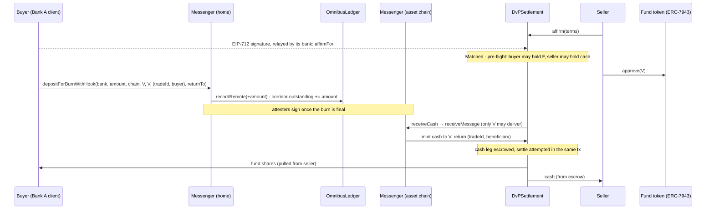

# DvP where the asset lives

How a bank's tokenized deposit settles delivery versus payment against a
tokenized security on a public chain, while the deposit's backing stays in
the operator's joint account at the Fed.

Contracts: `contracts/src/omnibus/dvp/DvPSettlement.sol`,
`contracts/src/omnibus/crosschain/CrossChainMessenger.sol`,
`contracts/src/omnibus/crosschain/RemoteBankToken.sol`.
Tests: `contracts/test/omnibus/DvP.t.sol` (21 scenarios),
`DvPInvariants.t.sol` (3 fuzzed invariants), `CrossChain.t.sol` (46, including
cancellations, rate limits, revocations and thresholds). Governance, emergency controls,
deployment and token replacement are in
[contract-operations.md](contract-operations.md).

## The problem

Atomic DvP needs both legs on one ledger: one transaction moves both, or
neither. The deposit tokens live on the operator's chain; tokenized Treasury and
money-market funds live mostly on public chains. Three ways to close the gap:

| Option | How | Trust it adds |
|---|---|---|
| 1. Asset comes to the operator | Securities issued on, or bridged to, the operator's chain | The operator becomes a securities venue |
| **2. Cash goes to the asset** | Burn at home, attested mint on the asset's chain, DvP there | The attester set, capped per corridor |
| 3. Legs stay apart, linked | Hold at home, release on attested delivery (or HTLC) | Conditional, not atomic: an attester error or a timeout leaves one leg moved |

This implements option 2. Settlement on the asset's chain is atomic (DvP
model 1). The cross-chain step before it moves money, not a trade leg, and
its failure modes (late, wrong, undeliverable) all end with the cash credited
and returnable, never with one leg of a trade moved.

## End to end

The Fed and the bank's backing do not move at any point: tokens abroad count
as the member's remote supply, and backing = home supply + remote supply.

## Design decisions, and why

**Pull the asset, escrow only the cash that arrives from home.** Tokeny's
official ERC-3643 DvD manager is pull-only, for a reason: ERC-3643's
`transferFrom` checks the sender and receiver's identities, not the
spender's. A contract that pulls the security seller → buyer needs no
identity on the security; a contract that escrows it must be a verified
holder and pass every compliance module. So the asset leg is pulled by
default, and escrowing it is optional for sellers whose token admits the
venue. Cash arriving from home has to land somewhere before the seller is
ready, so the venue must be admitted by the bank's holder policy on that
chain; that is the bank's own decision.

**Matched instructions, not maker/taker.** Both parties affirm identical
terms, directly or by an EIP-712 signature a bank or venue submits (ERC-1271
wallets supported). The trade id is the EIP-712 digest of the terms, bound to
chain and contract. This mirrors CSD matching: sese.023 from both sides,
matched sese.024. Terms carry both amounts in each token's own units, so the
contract does no price arithmetic and cannot round.

**The venue delivers its own messages.** Circle's CCTP V2 does not execute
hooks, and a documented trap in integrations is that anyone can relay a hooked
message directly: the tokens mint, the nonce is spent, the hook never runs.
Here the message names `destinationCaller`, and `receiveCash` delivers it and
reads the instruction from what the messenger returns, in one transaction.

**Arrival never reverts for a business reason.** A reverted delivery can
never be retried into success if its trade has lapsed, and the cash is
already locked at home. So cash for an unknown, closed, already-funded or lapsed
trade, a wrong amount, a malformed instruction or a paused venue is credited
to the beneficiary, who withdraws it or sends it home with
`withdrawCreditHome`.

**Refunds cannot strand.** A refund pushed to a funder that has since been
frozen or delisted would revert and block the other party's refund with it (the
USDC-blocklist finding pattern). A failed push becomes a credit instead.

**Cancellation follows AtomicDvP.** Before the match an affirmation is an
offer its maker may withdraw; a signed-but-unsubmitted affirmation can be
`revoke`d. A matched trade cancels only bilaterally or lapses at its deadline,
after which anyone closes it.

**No operator power over money.** No sweep, no upgrade (a new version is a new
deployment and a new EIP-712 domain), admin handover two-step and delayed
(`AccessControlDefaultAdminRules`). Pause stops matching, funding and
settlement; refunds, cancellation and withdrawals keep working. A regulator's
order against escrow goes through the issuing bank's forced transfer on the
token, as for any holder.

**Exact amounts.** Every leg checks the receiver's balance delta; a
fee-on-transfer or rebasing token fails the settlement. State is written
before transfers and every entry point is guarded, so a hook token cannot
settle twice.

## What changed under it

**RemoteBankToken** now carries the bank's controls on every chain: holder
policy on both sides, partial freeze, forced transfer, key recovery that blocks
the lost key, ERC-7943 through ERC-165. Before, a regulator's freeze order
could not be executed on the public chain.

**CrossChainMessenger** (message version 4):

- *Corridor caps.* Home tracks each member's `outstanding` supply per chain
  and refuses transfers above `corridorCap` (closed until governance opens it).
  A chain can never send home more than was sent to it, so a compromised chain
  or attester set is contained to that corridor.
- *Hub and spoke.* Other chains talk only to home, which keeps the per-chain
  count exact.
- *Two keys for every mint.* A message mints only with the operator's attester
  threshold and a signature from the issuing bank's own key on that chain. A
  compromised operator attester set cannot create a bank's deposits; a compromised bank key
  cannot mint without the operator; no key may hold both roles.
- *Supply cap on the other side too*, as Circle caps each minter: every
  non-home chain caps each member's supply there, so even with both key sets
  compromised a forged mint stops at the cap.
- *Slow governance.* The admin is meant to be a TimelockController (a new
  attester is public for the whole delay before it can sign), and handing the
  admin over is two-step and delayed. The remote token's admin, which can
  replace the holder policy, has the same two-step delay.
- *Destination caller and hook data*, as in CCTP V2.
- *Lock, mint, then burn:* the source escrows the cash and burns it only on
  the destination's attested MINT_ACK. A move that cannot mint is cancelled on
  the destination (after its deadline, or at once for a recipient who cannot
  hold the token) and the MINT_CANCEL returns the escrow to `returnTo`, or to
  the bank's suspense wallet if nobody can hold it. `withdrawCreditHome` names
  the credit owner as `returnTo`, so a cancelled send-home returns to them, not
  to the venue.
- *Inbound rate limit* on every receiving chain, per source chain and member;
  closed until governance opens it.
- *Revocations follow the token:* a bank's registrar at home broadcasts a
  revocation that applies on arrival; admissions stay local.
- *Pause* on sending and delivery; escrowed tokens stay in home supply, so a
  pause never leaves tokens under-backed.

## ISO 20022 mapping

| Contract event | Message |
|---|---|
| `Affirmed` | sese.023 received from that party |
| `Matched` | sese.024, matched |
| `SettlementPending` (reason bytes) | sese.024, pending, with reason |
| `Settled` | sese.025 confirmation |
| `Cancelled` | sese.024, cancelled |
| `Terms.ref` | the settlement transaction id, carried on every event |

## Operating rules the contract cannot enforce

- **Finality.** Attesters sign a cash message only once its burn is final at
  home. The rulebook defines settlement finality on the asset chain (on
  Ethereum, the finalized block containing `Settled`; on an L2, its L1
  finalization).
- **Deadlines.** Minutes to hours, not days: the ECB's 2024 trials found
  participants wanted timeouts of minutes.
- **Admission.** The bank admits the venue, its clients and each seller it is
  willing to owe money to, on that chain's registry. A registry per chain means
  a KYC revocation must reach every chain the bank's tokens can sit on.
- **Attesters.** The operator's keys in HSMs, threshold of at least 2 of 3, plus each
  bank's own issuer key; sign only once the burn is final (no fast transfer);
  corridor and supply caps sized to what a bank will lose if one chain is lost.

## Not done yet

- Netting across trades (DvP model 2 or 3): each trade settles gross.
- Asset pre-flight for ERC-3643 tokens that do not report ERC-7943 (they fail
  at settlement instead, with the token's own error).
- Permit2 witness transfers, so an approval is bound to one trade.
- A Go driver in `services/payments-svc` for trades on a public chain (the
  deployment scripts, including `DeployRemote` and `DeployBank.runRemote`,
  exist).
- An independent audit before any real value (Slither runs clean apart from
  two annotated false positives; see `make slither`).

## Research sources

- Tokeny T-REX DvD manager: github.com/TokenySolutions/T-REX/blob/main/contracts/DVD/DVDTransferManager.sol
- ERC-3643 token: github.com/ERC-3643/ERC-3643 (`contracts/token/Token.sol`); ERC-7943: eips.ethereum.org/EIPS/eip-7943
- ECB exploratory work on DLT settlement (2025 report): ecb.europa.eu/pub/pdf/other/ecb.exploratoryworknewtechnologies202506.en.pdf
- Canton token standard (allocations with deadlines): github.com/canton-foundation/cips (CIP-0056)
- CCTP V2 interfaces and hook wrapper: developers.circle.com/cctp/references/contract-interfaces; github.com/circlefin/evm-cctp-contracts (`src/examples/CCTPHookWrapper.sol`)
- CCIP defensive receiver: docs.chain.link/ccip/tutorials/programmable-token-transfers-defensive
- PFMI Principle 12 and DvP models: bis.org/fsi/fsisummaries/pfmi.pdf; bis.org/cpmi/publ/d06.pdf
- Weird ERC-20 behaviours: github.com/d-xo/weird-erc20
