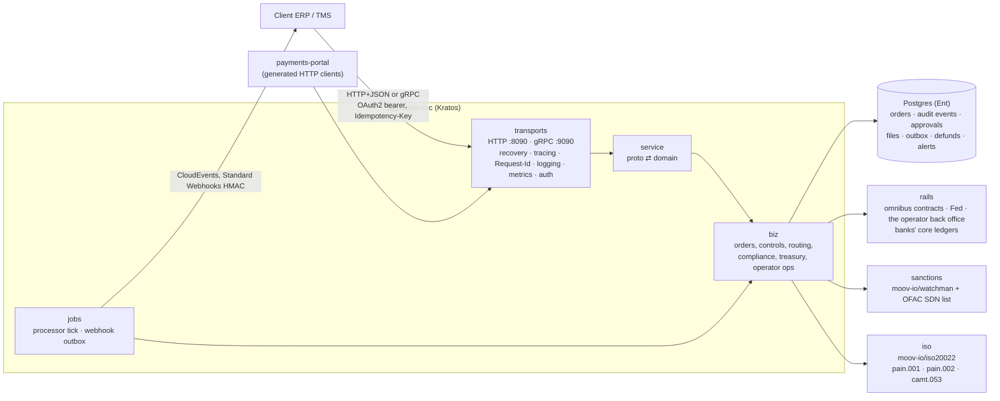

# payments-svc

A member bank's payment hub over the omnibus network, built with go-kratos,
proto-first APIs, Wire and Ent, and with moov-io's payments libraries where
the job is a financial standard:

- the **corporate payment channel**: payment orders by API or ISO 20022
  pain.001 file, maker-checker, limits, payee checks, pain.002 status
  reports, camt.053 statements and signed status webhooks;
- the **bank's operations console**: OFAC sanctions review, the omnibus
  position and its funding, defunds under maker-checker;
- **the operator's network console**: members, the Fed joint account against the
  ledger, netting cycles and reconciliation.

`services/payments-portal` is the web front end: server-rendered pages that
call this API through the generated Kratos HTTP clients, nothing else.

## Architecture



| Concern | Choice |
|---|---|
| Service framework | [go-kratos v2](https://go-kratos.dev): app lifecycle, HTTP and gRPC transports, middleware, config with `${ENV:default}` |
| API definition | protobuf with `google.api.http` annotations (`api/payments/v1`); Kratos generates the HTTP routes and clients, protoc the gRPC stubs, `protoc-gen-openapi` the OpenAPI document served at `/v1/openapi.yaml` |
| Dependency injection | [Wire](https://github.com/google/wire) (`cmd/payments-svc/wire.go`) |
| Persistence | [Ent](https://entgo.io) on PostgreSQL through pgx; pure-Go SQLite (modernc) for tests and local runs |
| ISO 20022 | [moov-io/iso20022](https://github.com/moov-io/iso20022): pain.001.001.10 parsed, pain.002.001.11 and camt.053.001.08 written from its message types |
| Sanctions | [moov-io/watchman](https://github.com/moov-io/watchman): the Treasury's SDN CSVs parsed by its OFAC reader, names scored with its Jaro-Winkler similarity |
| Routing numbers | [moov-io/ach](https://github.com/moov-io/ach) `CheckRoutingNumber` (ABA check digit) |
| Banking days | [moov-io/base](https://github.com/moov-io/base) Federal Reserve holiday calendar (OFAC reporting deadlines) |
| Authentication | OpenID Connect access tokens ([go-oidc](https://github.com/coreos/go-oidc)); static tokens in demo builds only |
| Notifications | CloudEvents 1.0 envelopes, [Standard Webhooks](https://www.standardwebhooks.com) signatures, transactional outbox |
| Metrics | Prometheus at `/metrics` |

## Layout

The standard go-kratos service layout:

```
api/payments/v1/     *.proto and generated *.pb.go, *_grpc.pb.go, *_http.pb.go
cmd/payments-svc/    main.go (config, prod guard), wire.go, wire_gen.go, providers.go
cmd/ofac-download/   fetches the current SDN list from treasury.gov
configs/             config.yaml (demo)
ent/schema/          PaymentOrder, OrderEvent, Approval, PaymentFile,
                     WebhookSubscription, WebhookDelivery, Defund, Alert,
                     NettingCycle, Reconciliation
internal/
  biz/        domain, ports (repos, rails, screener), use cases, processor
  data/       Ent repositories, transactions carried in the context
  service/    generated service interfaces, proto ⇄ domain
  server/     Kratos HTTP and gRPC servers, middleware, health, metrics
  rails/      the omnibus network and the banks' systems behind biz.Rails
  sanctions/  watchman-backed OFAC screening
  iso/        moov-io/iso20022 reader and writers
  notify/     outbox dispatcher, signatures, secret box, safe dialer
  auth/       bearer-token middleware (OIDC, static)
  jobs/       background loops as a Kratos server
  buildinfo/  demo vs production build tag
test/         black-box end-to-end test (binary, anvil, generated clients)
```

## API

Five services, 33 RPCs; each is also a REST route.

| Service | Routes | Who |
|---|---|---|
| `PaymentService` | `POST /v1/payments` · `GET /v1/payments[/{id}]` · `POST /v1/payments/{id}/approve\|decline\|cancel` · `GET /v1/payments/{id}/pain002` · `POST /v1/payment-files` · `GET /v1/payment-files/{id}/pain002` · `POST /v1/payees/verify` · `GET /v1/network/participants` | client organizations |
| `AccountService` | `GET /v1/me` · `GET /v1/account` · `GET /v1/account/statement[/camt053]` | client organizations |
| `WebhookService` | `POST /v1/webhooks` · `GET /v1/webhooks` · `DELETE /v1/webhooks/{id}` · `GET /v1/webhooks/{id}/deliveries` | a client's approvers |
| `BankOperationsService` | `GET /v1/ops/payments[/{id}]` · `GET /v1/ops/holds` · `POST /v1/ops/holds/{id}/release\|block\|reject` · `GET /v1/ops/liquidity` · `POST /v1/ops/funding` · `POST /v1/ops/defunds[/{id}/approve]` | the bank's compliance and treasury |
| `NetworkOperationsService` | `GET /v1/operator/network` · `POST /v1/operator/netting-cycles` · `POST /v1/operator/reconciliations` · `POST /v1/operator/clock` (demo builds) | Operator operations |

Errors are Kratos errors: `{"code":409,"reason":"DU04","message":"…"}` over
HTTP, the matching status with the reason over gRPC. Creates require an
`Idempotency-Key` (same body replays with `duplicateRequest: true`; a
different body is 422). Every reply carries `Request-Id`.

## How state is kept

- **Orders** carry a version; an update with a stale version is a conflict,
  never a silent overwrite.
- **Audit events and approvals** are append-only rows; a unique index makes
  "each approver counts once" a database fact.
- **Idempotency and duplicates** are unique indexes: (organization,
  idempotency key), (organization, end-to-end id), (organization, pain.001
  MsgId).
- **Webhooks** use a transactional outbox: the status change and its
  deliveries commit together; the dispatcher reads the outbox in order per
  endpoint and retries with backoff (5 s … 3 h). Signing secrets are sealed
  with AES-256-GCM at rest.
- **Clients never see tokens.** Each audit event has a client note and a
  staff-only detail; the client API, portal and webhooks carry only the note.
- The engine is a **single writer**: operations that touch the rails run
  under one lock, because the rails sign chain transactions from shared keys.
  Run one replica, or put the jobs behind leader election.

## Build, run, test

```bash
# once: contracts (from the repository root)
(cd ../../contracts && forge soldeer install && forge build)

make generate           # protoc (+ OpenAPI), ent, wire
make build              # production binary
make build-demo         # demo binaries: payments-svc and payments-portal

# demo: anvil from PATH, SQLite, the OFAC list in data/ofac
make ofac-data          # or OFAC_DIR=<watchman>/pkg/sources/ofac/testdata
./bin/payments-svc -conf configs            # :8090 HTTP, :9090 gRPC
./bin/payments-portal -api http://127.0.0.1:8090   # :8091

make test               # unit tests (-race)
make e2e                # builds the demo binary and drives the business week
PAYMENTS_TEST_POSTGRES='postgres://…' make e2e   # the same on Postgres
```

The end-to-end test (`test/`) runs the service as a black box. It starts the
binary against anvil, the contracts and the real OFAC SDN list, then drives
the business week through the generated clients:

- API payments and a pain.001 file with a partial reject;
- a netting cycle, a real SDN hit blocked with its OFAC date;
- the Saturday $25m payment through liquidity and LMT funding;
- a closed account refunded;
- a defund under maker-checker;
- the hourly cycle and a cancellation;
- reconciliation to the cent, and a camt.053;
- gRPC;
- 35 signed webhooks in order;
- the portal's forms with CSRF.

## Production guard

A build without `-tags demo` refuses to start with:

- static tokens;
- SQLite;
- loopback webhook endpoints;
- the demo encryption key.

The scenario clock (`SetClock`) answers PERMISSION_DENIED in a production build.

## Limits

- The rails adapter drives the model's simulators in-process: the Fed, the
  banks' core ledgers and, by default, a local anvil. Their state lives as
  long as the process; the hub's own state (orders, audit, outbox) is
  durable. A real deployment replaces `internal/rails` with integrations to
  the core banking system, Fedwire/FedNow and the network's chain nodes.
- The receiving bank accepts or rejects at once; ISO's accept-without-posting
  (ACWP) hold for its own sanctions review is not modelled.
- Recalls after settlement (camt.056) are not exposed.
- moov-io/iso20022 marshals an unused XSD choice branch as an empty element
  and a zero date as `0001-01-01`; `internal/iso` removes both before a
  document leaves, and its tests read every document back with moov-io's
  parser.
